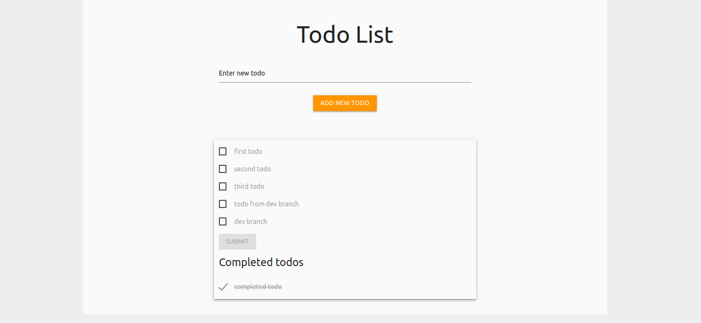

# To-do list, en PHP, JSON et AJAX

## Présentation du Projet

Projet créé le 09 Décembre 2019 dans le cadre de la formation Web Developer donnée par [BeCode](https://www.becode.org/), dans le but d'apprendre à manipuler des fichiers JSON avec PHP et AJAX.

Le projet est réalisé sur base des [instructions données](https://github.com/becodeorg/CRL-Woods-2.15/blob/master/Projects/TodolistJSON/todolist.md).

Le projet est hébergé sur [Heroku]().

### **[To-do list](https://github.com/kevin-labtani/todolist-json)**

Le Projet consiste en un outil de gestion de tâches basique comprenant:

- Un formulaire qui permet d'ajouter une tâche.
- Un formulaire avec une liste des tâches à faire et, pour chaque tâche, une checkbox permettant de marquer la tâche comme étant accomplie, et un bouton qui permet d'actualiser la liste des tâches.
- Les tâches encore à accomplir peuvent être réarrangées par drag and drop.
- Une liste des tâches déjà effectuées.

## Contributeurs

- [**Valeriya Kozlova**](https://github.com/ValeriyaKozlova)
- [**Kevin Labtani**](https://github.com/kevin-labtani)

## Langages et technologies

- PHP
- JavaScript
- HTML
- SASS

Le project est implémenté avec le framework CSS [**MaterializeCSS**](https://materializecss.com/).

- [x] HTML validated by [W3C Validator](https://validator.w3.org/)
- [x] JavaScript formatted with [Prettier](https://prettier.io/)
- [x] PHP formatted with [PHP cs fixer](https://github.com/FriendsOfPHP/PHP-CS-Fixer)

## Progression

Projet terminé le 16 Décembre 2019.

## Remerciements

- [BeCode](https://www.becode.org/) pour la formation.
- [Arnaud Duchemin](https://github.com/Cervant3s) pour le coaching.
- La promotion **CRL-Woods-2.15** pour l'aide et le support.
